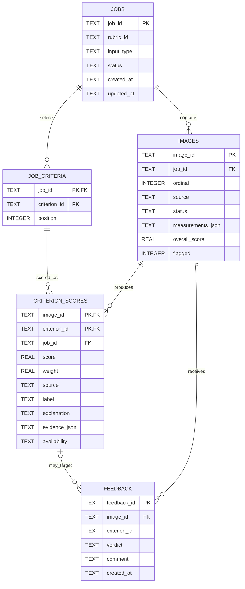

# Database Schema

**Jira:** SCRUM-156  
**Status:** In Review  
**Owner:** Bilal  
**Source contract:** SCRUM-182  
**Implementation handoff:** SCRUM-157

This document defines the SQLite schema for the Visual Brand Audit MVP. It is the repository-level engineering source of truth for jobs/batches, images, criterion scores and explanations, and reviewer feedback.

## Design goals

The schema must support:

- one submission as one background job/batch;
- the rubric and selected criteria used for each job;
- every submitted image, including filtered or failed images;
- CV measurements, criterion-level scores/explanations/evidence, overall scores, and flags;
- whole-image or criterion-specific reviewer feedback;
- job-status polling and results-dashboard queries without duplicated summary state;
- a clean implementation handoff to SCRUM-157.

## Key decisions

- **One job equals one batch.** The MVP does not need a separate `batches` table.
- **Five relational tables:** `jobs`, `job_criteria`, `images`, `criterion_scores`, and `feedback`.
- **Rubric definitions remain in `brand_standards.json`.** The database stores the versioned `rubric_id` used by each job.
- **Selected criteria are normalized.** `job_criteria` preserves the exact criterion subset and order used for a job.
- **Derived summaries are not stored.** Progress counters, mean overall score, flagged count, and score-distribution buckets are calculated from persisted rows.
- **Flexible analyzer output is stored as JSON text.** `measurements_json` and `evidence_json` allow additive CV-output changes without unnecessary migrations.
- **UUIDs are stored as `TEXT` primary keys.**
- **Timestamps are ISO 8601 UTC strings stored as `TEXT` with millisecond precision** (e.g. `2026-10-05T14:03:22.123Z`) so time ordering is reliable.
- **Booleans are stored as SQLite `INTEGER` values `0/1`.**
- **Foreign keys are enabled and child rows cascade when a job/image is deleted.**
- **A score can only exist for a criterion the job selected.** `criterion_scores` carries `job_id`, and a composite foreign key to `job_criteria(job_id, criterion_id)` enforces this in the database. A second composite key to `images(image_id, job_id)` guarantees the stored `job_id` always matches the image's own job, so the copy cannot drift.

## Entity relationship model



## Tables

### `jobs`

One row per accepted analysis request. This row owns the job lifecycle and the rubric version used.

| Column | Type | Null? | Purpose / constraint |
|---|---|---:|---|
| `job_id` | TEXT | No | Primary key; server-generated UUID4. |
| `rubric_id` | TEXT | No | Versioned rubric identifier such as `default-v1`. |
| `input_type` | TEXT | No | `upload` or `url`; URL is reserved for stretch. |
| `submission_url` | TEXT | Yes | Original website URL for stretch URL jobs. |
| `max_pages` | INTEGER | Yes | Positive crawler limit when present. |
| `status` | TEXT | No | `queued`, `crawling`, `preprocessing`, `analyzing`, `scoring`, `completed`, `completed_with_errors`, or `failed`. |
| `error_code` | TEXT | Yes | Job-level error code when the job fails. |
| `error_message` | TEXT | Yes | Human-readable job-level failure message. |
| `error_details_json` | TEXT | Yes | Optional structured error details serialized as JSON. |
| `created_at` | TEXT | No | ISO 8601 UTC timestamp. |
| `updated_at` | TEXT | No | ISO 8601 UTC timestamp. |

### `job_criteria`

Stores the criterion set actually selected for a job. If the API request omits `criterion_ids`, the backend resolves that to all criteria in the rubric and persists those rows.

| Column | Type | Null? | Purpose / constraint |
|---|---|---:|---|
| `job_id` | TEXT | No | FK to `jobs.job_id`; composite PK. |
| `criterion_id` | TEXT | No | Criterion slug; composite PK. |
| `position` | INTEGER | No | Zero-based display/evaluation order; unique within a job. |

Primary key: `(`job_id`, `criterion_id`)`.

### `images`

One row per submitted or discovered image. Upload jobs should create these rows as soon as the files are accepted so job progress can count the full batch immediately.

| Column | Type | Null? | Purpose / constraint |
|---|---|---:|---|
| `image_id` | TEXT | No | Primary key; server-generated UUID4. |
| `job_id` | TEXT | No | FK to `jobs.job_id`. |
| `ordinal` | INTEGER | No | Zero-based input order; unique within a job. |
| `source` | TEXT | No | `upload:filename.jpg` or an image URL. |
| `raw_path` | TEXT | Yes | Local `cache/raw` path when available. |
| `processed_path` | TEXT | Yes | Local `cache/processed` path after standardization. |
| `status` | TEXT | Yes | Null while processing; terminal value is `scored`, `partial`, `failed`, or `filtered_out`. |
| `reject_reason` | TEXT | Yes | Rejection reason for filtered images. |
| `width` | INTEGER | Yes | Standardized width when available. |
| `height` | INTEGER | Yes | Standardized height when available. |
| `color_mode` | TEXT | Yes | Expected `RGB` for kept standardized images. |
| `measurements_json` | TEXT | Yes | Serialized CV measurements from SCRUM-182. |
| `overall_score` | REAL | Yes | Final `0..100` score; null before scoring or for failed/filtered images. |
| `flagged` | INTEGER | Yes | `0/1`; null before final scoring. |
| `error_code` | TEXT | Yes | Image-level error code when applicable. |
| `error_message` | TEXT | Yes | Image-level error message. |
| `created_at` | TEXT | No | ISO 8601 UTC timestamp. |
| `updated_at` | TEXT | No | ISO 8601 UTC timestamp. |

### `criterion_scores`

One row per evaluated criterion per image.

| Column | Type | Null? | Purpose / constraint |
|---|---|---:|---|
| `image_id` | TEXT | No | FK to `images.image_id`; composite PK. |
| `criterion_id` | TEXT | No | Criterion slug; composite PK. |
| `job_id` | TEXT | No | The image's job. With `criterion_id`, FK to `job_criteria`; with `image_id`, FK to `images(image_id, job_id)`. Copied from the image row and kept honest by those keys. |
| `score` | REAL | Yes | `0..100`; null only when unavailable. |
| `weight` | REAL | No | Effective `0..1` weight actually used for this image. |
| `source` | TEXT | No | `cv` or `vlm`. |
| `label` | TEXT | Yes | Optional qualitative label, e.g. tone. |
| `explanation` | TEXT | Yes | Human-readable explanation returned to the UI. |
| `evidence_json` | TEXT | Yes | JSON array of short evidence strings. |
| `availability` | TEXT | No | `ok` or `unavailable_needs_review`. |
| `created_at` | TEXT | No | ISO 8601 UTC timestamp. |
| `updated_at` | TEXT | No | ISO 8601 UTC timestamp. |

Primary key: `(`image_id`, `criterion_id`)`.

The two composite keys mean the database rejects a score for a criterion the job did not select, and a score whose `job_id` disagrees with its image. The backend must set `job_id` from the image's job when inserting.

`weight` is intentionally stored as a result snapshot because the scoring engine can renormalize weights when criteria are unavailable.

### `feedback`

Append-only reviewer feedback. A null `criterion_id` applies to the whole image; a populated `criterion_id` targets one criterion result.

| Column | Type | Null? | Purpose / constraint |
|---|---|---:|---|
| `feedback_id` | TEXT | No | Primary key; server-generated UUID4. |
| `image_id` | TEXT | No | FK to `images.image_id`. |
| `criterion_id` | TEXT | Yes | Optional criterion target. |
| `verdict` | TEXT | No | `agree` or `disagree`. |
| `comment` | TEXT | Yes | Optional reviewer comment, max 1000 chars. |
| `created_at` | TEXT | No | ISO 8601 UTC timestamp. |

Older feedback rows are preserved for history. The API returns the latest row by ordering `created_at DESC, feedback_id DESC`. The `feedback_id` column only makes the result stable when two rows share a millisecond; it is a random UUID, so it does not guarantee the newest of those rows wins. At MVP scale (a reviewer clicking Agree/Disagree) this is accepted. If strict recency is ever needed, use time-ordered IDs (UUIDv7/ULID) or a sequence column.

## Relationships and constraints

- `jobs.job_id -> job_criteria.job_id` uses `ON DELETE CASCADE`.
- `jobs.job_id -> images.job_id` uses `ON DELETE CASCADE`.
- `images.image_id -> criterion_scores.image_id` uses `ON DELETE CASCADE`.
- `(criterion_scores.job_id, criterion_scores.criterion_id)` references `(job_criteria.job_id, job_criteria.criterion_id)` with `ON DELETE CASCADE`.
- `(criterion_scores.image_id, criterion_scores.job_id)` references `(images.image_id, images.job_id)` with `ON DELETE CASCADE`; `images` has `UNIQUE (image_id, job_id)` so SQLite accepts this as a foreign-key target.
- `images.image_id -> feedback.image_id` uses `ON DELETE CASCADE`.
- `(feedback.image_id, feedback.criterion_id)` optionally references `(criterion_scores.image_id, criterion_scores.criterion_id)`.
- `UNIQUE(job_id, ordinal)` preserves image ordering within a job.
- `UNIQUE(job_id, position)` preserves criterion ordering within a job.
- `CHECK` constraints enforce enum values, score/weight ranges, positive dimensions, valid booleans, and feedback comment length.
- `PRAGMA foreign_keys = ON` must be enabled for every connection.

## Mapping from SCRUM-182

| SCRUM-182 object | Stored in | Notes |
|---|---|---|
| `JobAccepted` / `JobStatus` | `jobs` | Job identity, lifecycle status, timestamps, job errors. |
| Selected `criterion_ids` | `job_criteria` | Explicit rows preserve selected subset and order. |
| `ImageResult` header | `images` | Source, terminal status, overall score, flagged state. |
| `ImageResult.measurements` | `images.measurements_json` | Flexible JSON while CV keys are still evolving. |
| `CriterionResult` | `criterion_scores` | Score, effective weight, source, label, explanation, evidence, availability. |
| `FeedbackSubmission` | `feedback` | Whole-image or criterion-specific feedback. |
| Rubric configuration | `brand_standards.json` + `jobs.rubric_id` | Rubric definitions are not duplicated into SQLite. |

## Planned MVP queries

### Job-status polling

```sql
SELECT
    j.job_id,
    j.status,
    j.created_at,
    j.updated_at,
    j.error_code,
    j.error_message,
    COUNT(i.image_id) AS images_total,
    SUM(CASE WHEN i.status IS NOT NULL THEN 1 ELSE 0 END) AS images_done,
    SUM(CASE WHEN i.status = 'failed' THEN 1 ELSE 0 END) AS images_failed
FROM jobs AS j
LEFT JOIN images AS i ON i.job_id = j.job_id
WHERE j.job_id = ?
GROUP BY j.job_id;
```

This keeps progress derived from authoritative image rows rather than duplicating counters that can drift.

### Job-results summary

```sql
SELECT
    COUNT(CASE WHEN overall_score IS NOT NULL THEN 1 END) AS images_scored,
    AVG(overall_score) AS mean_overall,
    SUM(CASE WHEN flagged = 1 THEN 1 ELSE 0 END) AS flagged_count
FROM images
WHERE job_id = ?;
```

Score-distribution buckets are calculated in application code from `overall_score`.

### Ordered image results

```sql
SELECT *
FROM images
WHERE job_id = ?
ORDER BY ordinal;
```

### Criterion results for one image

```sql
SELECT cs.*
FROM criterion_scores AS cs
JOIN job_criteria AS jc
  ON jc.job_id = cs.job_id
 AND jc.criterion_id = cs.criterion_id
WHERE cs.image_id = ?
ORDER BY jc.position;
```

### Latest feedback

```sql
SELECT *
FROM feedback
WHERE image_id = ?
ORDER BY created_at DESC, feedback_id DESC
LIMIT 1;
```

Criterion-specific feedback adds `AND criterion_id = ?`.

## Reference SQLite DDL

SCRUM-157 may implement the equivalent schema through an ORM/migration tool. The resulting constraints and relationships should remain equivalent to the reference DDL below.

```sql
PRAGMA foreign_keys = ON;

CREATE TABLE jobs (
    job_id TEXT PRIMARY KEY,
    rubric_id TEXT NOT NULL,
    input_type TEXT NOT NULL
        CHECK (input_type IN ('upload', 'url')),
    submission_url TEXT,
    max_pages INTEGER
        CHECK (max_pages IS NULL OR max_pages > 0),
    status TEXT NOT NULL
        CHECK (status IN (
            'queued',
            'crawling',
            'preprocessing',
            'analyzing',
            'scoring',
            'completed',
            'completed_with_errors',
            'failed'
        )),
    error_code TEXT,
    error_message TEXT,
    error_details_json TEXT,
    created_at TEXT NOT NULL,
    updated_at TEXT NOT NULL,
    CHECK (input_type <> 'url' OR submission_url IS NOT NULL)
);

CREATE TABLE job_criteria (
    job_id TEXT NOT NULL,
    criterion_id TEXT NOT NULL,
    position INTEGER NOT NULL CHECK (position >= 0),
    PRIMARY KEY (job_id, criterion_id),
    UNIQUE (job_id, position),
    FOREIGN KEY (job_id)
        REFERENCES jobs(job_id)
        ON DELETE CASCADE
);

CREATE TABLE images (
    image_id TEXT PRIMARY KEY,
    job_id TEXT NOT NULL,
    ordinal INTEGER NOT NULL CHECK (ordinal >= 0),
    source TEXT NOT NULL,
    raw_path TEXT,
    processed_path TEXT,
    status TEXT
        CHECK (
            status IS NULL OR
            status IN ('scored', 'partial', 'failed', 'filtered_out')
        ),
    reject_reason TEXT
        CHECK (
            reject_reason IS NULL OR
            reject_reason IN (
                'unsupported_format',
                'too_many_pixels',
                'animated',
                'too_small',
                'extreme_aspect_ratio',
                'unprocessable'
            )
        ),
    width INTEGER CHECK (width IS NULL OR width > 0),
    height INTEGER CHECK (height IS NULL OR height > 0),
    color_mode TEXT,
    measurements_json TEXT,
    overall_score REAL
        CHECK (
            overall_score IS NULL OR
            (overall_score >= 0 AND overall_score <= 100)
        ),
    flagged INTEGER
        CHECK (flagged IS NULL OR flagged IN (0, 1)),
    error_code TEXT,
    error_message TEXT,
    created_at TEXT NOT NULL,
    updated_at TEXT NOT NULL,
    UNIQUE (job_id, ordinal),
    UNIQUE (image_id, job_id),
    FOREIGN KEY (job_id)
        REFERENCES jobs(job_id)
        ON DELETE CASCADE,
    CHECK (status <> 'filtered_out' OR reject_reason IS NOT NULL)
);

CREATE TABLE criterion_scores (
    image_id TEXT NOT NULL,
    criterion_id TEXT NOT NULL,
    job_id TEXT NOT NULL,
    score REAL
        CHECK (
            score IS NULL OR
            (score >= 0 AND score <= 100)
        ),
    weight REAL NOT NULL
        CHECK (weight >= 0 AND weight <= 1),
    source TEXT NOT NULL
        CHECK (source IN ('cv', 'vlm')),
    label TEXT,
    explanation TEXT,
    evidence_json TEXT,
    availability TEXT NOT NULL
        CHECK (availability IN ('ok', 'unavailable_needs_review')),
    created_at TEXT NOT NULL,
    updated_at TEXT NOT NULL,
    PRIMARY KEY (image_id, criterion_id),
    FOREIGN KEY (image_id, job_id)
        REFERENCES images(image_id, job_id)
        ON DELETE CASCADE,
    FOREIGN KEY (job_id, criterion_id)
        REFERENCES job_criteria(job_id, criterion_id)
        ON DELETE CASCADE,
    CHECK (
        (availability = 'ok' AND score IS NOT NULL) OR
        (availability = 'unavailable_needs_review' AND score IS NULL)
    )
);

CREATE TABLE feedback (
    feedback_id TEXT PRIMARY KEY,
    image_id TEXT NOT NULL,
    criterion_id TEXT,
    verdict TEXT NOT NULL
        CHECK (verdict IN ('agree', 'disagree')),
    comment TEXT
        CHECK (comment IS NULL OR length(comment) <= 1000),
    created_at TEXT NOT NULL,
    FOREIGN KEY (image_id)
        REFERENCES images(image_id)
        ON DELETE CASCADE,
    FOREIGN KEY (image_id, criterion_id)
        REFERENCES criterion_scores(image_id, criterion_id)
        ON DELETE CASCADE
);

CREATE INDEX idx_jobs_status_updated
    ON jobs(status, updated_at);

CREATE INDEX idx_images_job_status
    ON images(job_id, status);

CREATE INDEX idx_feedback_image_criterion_created
    ON feedback(image_id, criterion_id, created_at DESC);
```

## Write lifecycle

1. Insert `jobs` with `status = 'queued'`.
2. Resolve the selected criteria from `brand_standards.json` and insert `job_criteria` in rubric order.
3. Insert one `images` row per accepted upload with a stable `ordinal` and `status = NULL`.
4. During preprocessing, populate paths/dimensions or set `filtered_out` + `reject_reason`.
5. Persist CV measurements in `measurements_json` and criterion results in `criterion_scores` (set each row's `job_id` from its image; the database rejects criteria the job did not select).
6. After scoring, write `overall_score`, `flagged`, and terminal image status (`scored` or `partial`).
7. For unrecoverable image failures, set `status = 'failed'` and populate image error fields.
8. Finalize the job as `completed`, `completed_with_errors`, or `failed`.
9. Insert feedback rows without overwriting prior feedback.

## Implementation notes for SCRUM-157

- Enable `PRAGMA foreign_keys = ON` on every connection.
- Prefer WAL mode for local development if job-status reads may occur while a background worker writes.
- Use transactions for multi-row state changes such as criterion scores plus final image score/status.
- Generate UUID4 identifiers and ISO 8601 UTC timestamps (millisecond precision) in the backend.
- If using an ORM, model `CriterionScore` with `job_id` and both composite foreign keys; verify the generated migration contains them.
- Keep rubric IDs immutable/versioned so old jobs remain reproducible.
- Validate `measurements_json` and `evidence_json` in application code.
- Keep score-distribution bucketing in application code rather than a persistent aggregation table.
- If the prototype later needs multiple API/worker instances with heavier concurrent writes, consider PostgreSQL rather than adding complexity to the SQLite design.

## Open items

- The `0..100` scoring scale and flag threshold remain rubric-level assumptions from SCRUM-182; the database does not hard-code a threshold.
- SCRUM-180/181 may still change criterion names or rubric contents. Because criteria are data, not columns, that should not require a database migration.
- CV measurement keys are still provisional; `measurements_json` intentionally prevents schema churn.
- No reviewer/user identity table is included because authentication/reviewer accounts are outside the current MVP contract.
- No crawler/page tables are included in the MVP. Stretch URL jobs store the submitted URL on `jobs` and resulting image URLs on `images`.
- The MVP stores validated model results, not full raw VLM transcripts.

## Acceptance-criteria check

- Required entities are represented: jobs/batches, images, scores/explanations, and feedback.
- Required relationships are represented with foreign keys, including scores being restricted to the job's selected criteria.
- Planned MVP queries are supported: job status, progress, dashboard summary, ordered results, criterion details, and feedback.
- Derived progress/dashboard summaries are not duplicated in persistent storage.
- The reference DDL is directly usable as the design basis for SCRUM-157 migrations.
